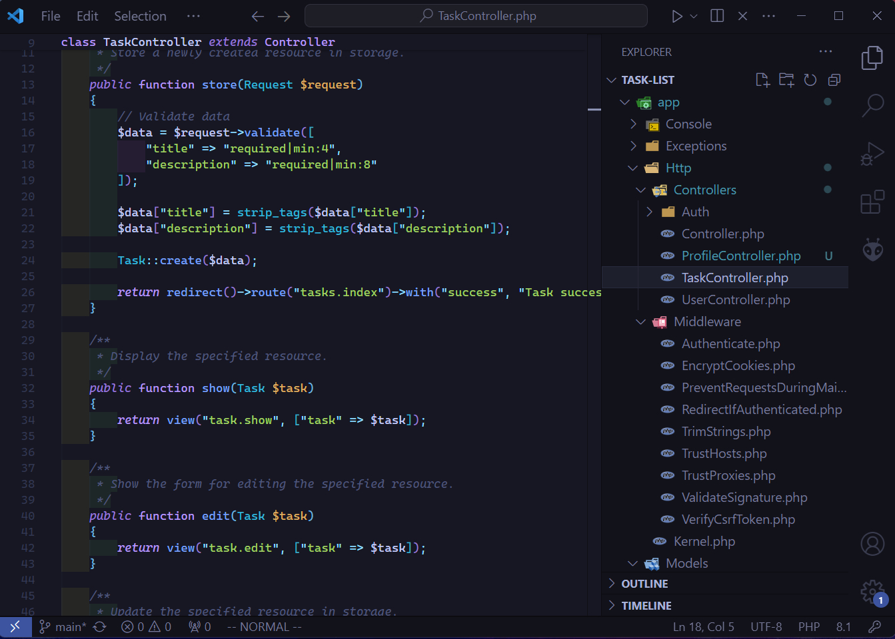

# VSCode like Vim: Boost Your Productivity

<p align="center">
  <a href="https://skillicons.dev">
    
  </a>
</p>

<p>
Welcome to the repository designed to transform your VSCode experience into a Vim-like environment. By leveraging keybindings and settings optimized for productivity, you can enjoy the efficiency and speed of Vim within the powerful VSCode IDE.
</p>

## Introduction

This repository provides everything you need to make VSCode behave like Vim. Whether you're a seasoned Vim user or someone looking to enhance their coding efficiency, this setup is for you. The configuration includes custom keybindings, settings adjustments, and a carefully selected color scheme to optimize your development environment.



## Installation

### Setup Steps
Before you begin, ensure you have the following installed:

1. VSCode IDE:
    - [VSCode](https://code.visualstudio.com/): The latest version of Visual Studio Code.

2. VSCode extensions:
    - [Vim Extension](https://marketplace.visualstudio.com/items?itemName=vscodevim.vim): For Vim keybindings and commands.
    - [Harpoon Extension](https://marketplace.visualstudio.com/items?itemName=tobias-z.vscode-harpoon): For enhanced navigation.
    - [Tokyo Night Colorscheme](https://marketplace.visualstudio.com/items?itemName=enkia.tokyo-night): For a visually appealing and distraction-free coding experience.

3. Font:
    - [Cascadia Code Font](https://github.com/microsoft/cascadia-code): A monospaced font designed for coding.

4. Clone the Repository:

```console
git clone https://github.com/LubosNoska13/vscode-like-vim.git
```

5. Replace Configuration Files:

    - Navigate to your VSCode user settings directory.
    - Replace **settings.json** and **keybindings.json** with the files from this repository.

    Typically, these files are located in:

    - **Windows**: %APPDATA%\Code\User\
    - **macOS**: ~/Library/Application Support/Code/User/
    - **Linux**: ~/.config/Code/User/

6. Restart VSCode: To apply the new settings and keybindings, restart your VSCode

## Contributing
Contributions are welcome! If you have suggestions for improvements or new features, feel free to open an issue or submit a pull request.

## License
This project is licensed under the MIT License. See the [LICENSE](LICENSE) file for details.

---

By following these steps and using the provided configuration files, you can significantly enhance your productivity with a streamlined and efficient coding environment in VSCode. Happy coding!
